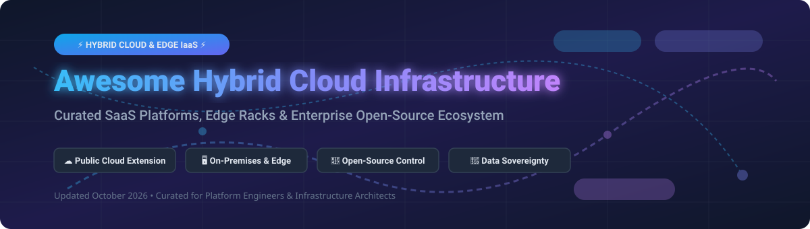

# 🌐 Awesome Hybrid Cloud Infrastructure

<p align="center">
  
</p>

<p align="center">
  <a href="https://github.com/ishandutta2007/Awesome-Awesome-Awesome"></a><a href="https://discord.gg/jc4xtF58Ve"></a>
  
  
  
  
  <a href="https://github.com/ishandutta2007"></a>
</p>

---

## 🚀 Overview & Market Landscape

Welcome to **Awesome Hybrid Cloud Infrastructure** — a curated catalog of enterprise **SaaS / Managed Platforms** and **Open-Source GitHub Projects** powering modern hybrid cloud, edge computing, software-defined data centers (SDDC), and sovereign cloud architectures.

### 📊 Hybrid Cloud Infrastructure Market Overview
- **Market Size**: The global Hybrid Cloud Market is estimated at **~$125 Billion in 2026** and is projected to reach **>$250 Billion by 2030**, growing at a CAGR of ~18-20%.
- **Market Fragmentation**: The sector is **moderately fragmented**, dominated at the upper tier by hyperscalers (AWS, Microsoft Azure, Google Cloud) for managed hybrid extensions, alongside legacy hardware giants (Dell, HPE, Cisco) and virtualization leaders (VMware/Broadcom, Nutanix), while vibrant open-source foundations (Linux Foundation, CNCF, OpenInfra) supply independent control planes to mitigate vendor lock-in.

---

## 📑 Table of Contents

- [☁️ SaaS / Managed Platforms](#-saas--managed-platforms)
- [🐧 Open-Source GitHub Projects](#-open-source-github-projects)
- [🛠️ Architecture & Best Practices](#%EF%B8%8F-architecture--best-practices)
- [🤝 How to Contribute](#-how-to-contribute)
- [💖 Support & Sponsorship](#-support--sponsorship)
- [📈 Star History](#-star-history)
- [⚠️ Disclaimer](#%EF%B8%8F-disclaimer)

---

## ☁️ SaaS / Managed Platforms

The table below summarizes commercial hybrid cloud platforms, ordered by company size (valuation / annual revenue descending):

| Platform / Vendor | Enterprise Description | Commercial Pricing Model | Free Tier / Trial Limit | Company Size (Revenue / Valuation) |
| :--- | :--- | :--- | :--- | :--- |
| **[Azure Stack / Azure Arc](https://azure.microsoft.com/products/azure-stack/)** | Microsoft’s hybrid suite — Azure Arc extends Azure management, RBAC, Defender, & GitOps to any server or K8s cluster on-prem/multi-cloud. | Core Arc control plane free; Azure Guest Management features ~$9.01/server/month; Azure Monitor $2.30/GB ingested. | Core control plane free forever; $200 Azure credit for 30 days. | **~$3.1 Trillion** market cap (Microsoft) |
| **[Google Distributed Cloud](https://cloud.google.com/distributed-cloud)** | Google Cloud portfolio running GKE, Anthos, and GCP services on-premises, edge, and sovereign environments. | Subscription per node/core + hardware appliance lease fees. | $300 free trial credits valid for 90 days. | **~$2.1 Trillion** market cap (Alphabet) |
| **[AWS Outposts](https://aws.amazon.com/outposts/)** | Fully managed AWS hardware rack/server delivered on-prem for ultra-low latency & local data sovereignty. | 3-year term commitment; starting ~$150,000–$500,000 total 3-yr commitment (All Upfront, Partial Upfront, or Monthly). | AWS Free Tier includes 12-month access to cloud services (Outposts hardware requires paid order). | **~$2.0 Trillion** market cap (Amazon) |
| **[VMware Cloud on AWS](https://cloud.vmware.com/vmc-aws)** | VMware SDDC (vSphere, vSAN, NSX) running natively on dedicated AWS bare-metal infrastructure. | On-Demand per host from ~$8.50/host/hr; 1-yr/3-yr reserved instances offer up to 50% discount. | No permanent free tier; hands-on lab access available via VMware Cloud Sizer / Guided Demos. | **~$166 Billion** market cap (Broadcom / VMware) |
| **[Cisco Compute Hyperconverged](https://www.cisco.com/c/en/us/products/hyperconverged-infrastructure/index.html)** | Cisco’s hyperconverged platform (transitioned from HyperFlex to Cisco Compute HCI with Nutanix) for hybrid data centers. | Subscription licensing per node/core + hardware UCS server pricing. | Free interactive demos via Cisco dCloud; 90-day evaluation licenses available via partners. | **~$200 Billion** market cap (Cisco Systems) |
| **[Dell EMC VxRail](https://www.dell.com/en-us/dt/vxrail/index.htm)** | Jointly engineered Dell & VMware hyperconverged appliance powering private & hybrid cloud environments. | Custom hardware + software quote; options for APEX consumption model (~$70/node/day). | No free physical hardware tier; online interactive trial & sizing tool available. | **~$85 Billion** market cap (Dell Technologies) |
| **[HPE GreenLake](https://www.hpe.com/us/en/greenlake.html)** | HPE's edge-to-cloud as-a-service platform delivering pay-per-use hybrid compute, storage, and private cloud. | Metered usage-based billing with baseline minimum monthly commitment. | HPE GreenLake Test Drive provides interactive hands-on scenario trials at no cost. | **~$25 Billion** market cap (Hewlett Packard Enterprise) |
| **[Nutanix Cloud Platform](https://www.nutanix.com/)** | Enterprise HCI software (NCI, AHV, NC2) unifying VMs, containers, and storage across on-prem, AWS, and Azure. | NCI software subscription from ~$650–$1,700 per CPU core/year; NC2 metered hourly on public cloud. | 30-day free trial for Nutanix Cloud Clusters (NC2); free self-hosted Nutanix Community Edition. | **~$16 Billion** market cap (Nutanix Inc.) |
| **[Red Hat OpenStack Platform](https://www.redhat.com/en/technologies/linux-platforms/openstack-platform)** | Enterprise OpenStack distribution powering hybrid IaaS, telecom NFV, and private enterprise clouds. | Annual subscription based on CPU socket-pairs (covers up to 2 physical CPU sockets per node). | 60-day self-supported evaluation subscription available via Red Hat Customer Portal. | **~$35 Billion** annual revenue segment (IBM Red Hat) |
| **[OpenNebula Enterprise](https://opennebula.io/)** | Commercial edition and support for OpenNebula cloud & edge orchestration software. | Elemental Plan from €3,000/yr base + €300/managed host/yr; Standard from €7,000/yr + €700/host. | Free community edition (OpenNebula CE) available forever with full features. | **~$15 Million** annual revenue (OpenNebula Systems) |

---

## 🐧 Open-Source GitHub Projects

Explore top open-source projects for building sovereign private clouds, hybrid control planes, container fleets, and edge infrastructure. Ranked by GitHub star count (descending):

| Project | Stars | Category & Description |
| :--- | :--- | :--- |
| **[Rancher](https://github.com/rancher/rancher)** | [](https://github.com/rancher/rancher/stargazers) | **Multi-Cluster K8s Management**: Complete container management platform for managing Kubernetes clusters across multi-cloud, hybrid, and edge environments. |
| **[Cilium](https://github.com/cilium/cilium)** | [](https://github.com/cilium/cilium/stargazers) | **eBPF Hybrid Networking & Security**: eBPF-based networking, observability, and security connectivity for hybrid and multi-cloud Kubernetes fleets. |
| **[Crossplane](https://github.com/crossplane/crossplane)** | [](https://github.com/crossplane/crossplane/stargazers) | **Universal Control Plane**: Cloud-native framework extending Kubernetes APIs to provision and manage cloud infrastructure across AWS, Azure, GCP, and on-premises. |
| **[vcluster](https://github.com/loft-sh/vcluster)** | [](https://github.com/loft-sh/vcluster/stargazers) | **Virtual Kubernetes Clusters**: Create lightweight, fully functional virtual Kubernetes clusters inside an existing host cluster for secure hybrid multi-tenancy. |
| **[OpenEBS](https://github.com/openebs/openebs)** | [](https://github.com/openebs/openebs/stargazers) | **Container Attached Storage**: Leading open-source Container Attached Storage (CAS) for stateful applications running on hybrid Kubernetes. |
| **[KubeVirt](https://github.com/kubevirt/kubevirt)** | [](https://github.com/kubevirt/kubevirt/stargazers) | **VMs on Kubernetes**: Kubernetes add-on technology that runs legacy virtual machine workloads side-by-side with containers. |
| **[OpenStack](https://github.com/openstack/openstack)** | [](https://github.com/openstack/openstack/stargazers) | **Cloud IaaS Engine**: The premier open-source cloud operating system for compute (Nova), storage (Cinder), and networking (Neutron). |
| **[Harvester](https://github.com/harvester/harvester)** | [](https://github.com/harvester/harvester/stargazers) | **Open-Source Hyperconverged Infrastructure (HCI)**: Built on Kubernetes, KubeVirt, and Longhorn as an open alternative to VMware vSphere & Nutanix. |
| **[Apache CloudStack](https://github.com/apache/cloudstack)** | [](https://github.com/apache/cloudstack/stargazers) | **Turnkey IaaS Cloud**: Turnkey open-source Infrastructure-as-a-Service software designed to deploy and manage high-availability compute clouds. |
| **[OpenNebula](https://github.com/OpenNebula/one)** | [](https://github.com/OpenNebula/one/stargazers) | **Cloud & Edge Manager**: Simple, lightweight open-source platform to build private clouds and manage edge computing infrastructure. |
| **[Proxmox VE (PVE)](https://github.com/proxmox)** | [](https://github.com/proxmox) | **Virtualization Platform**: Complete open-source server management platform combining KVM virtualization, LXC containers, and Ceph storage clustering. |

---

## 🛠️ Architecture & Best Practices

When engineering a custom hybrid cloud infrastructure, platform architects typically follow a layered pattern:

```
┌──────────────────────────────────────────────────────────────────┐
│                   Unified Developer Control Plane                │
│             (Crossplane / Kubernetes Cluster API / GitOps)       │
└─────────────────────────────────┬────────────────────────────────┘
                                  │
          ┌───────────────────────┴───────────────────────┐
          ▼                                               ▼
┌───────────────────────────┐                   ┌───────────────────┐
│     On-Premises / Edge    │                   │   Public Cloud    │
│  (OpenStack / OpenNebula  │<== VPN / Direct =>│   (AWS / Azure /  │
│    Proxmox / Harvester)   │    Interconnect   │       GCP)        │
└───────────────────────────┘                   └───────────────────┘
```

1. **Deploy Control Plane**: Use **OpenStack**, **OpenNebula**, or **Harvester** for bare-metal / VM provisioning on-premises.
2. **Federate Network & Identity**: Establish secure IPSec VPN or Dedicated Cloud Interconnect (AWS DirectConnect / Azure ExpressRoute).
3. **Container Orchestration**: Standardize container runtime using **Kubernetes**, **Rancher**, or **vcluster**.
4. **Declarative Provisioning**: Employ **Crossplane** or **Terraform** for unified multi-cloud infrastructure declaration.

---

## 🤝 How to Contribute

Contributions are highly welcome! Please follow these simple steps to add new products or open-source tools:

1. **Fork** the repository.
2. Add your entry into `README.md` adhering to the existing Markdown table format.
3. Ensure all links point to authoritative official documentation or GitHub repositories.
4. Open a **Pull Request** with a descriptive summary of changes.

---

## 💖 Support & Sponsorship

Thank you for visiting and supporting **Awesome Hybrid Cloud Infrastructure**!

If you find this repository valuable for your platform engineering team, cloud architecture research, or open-source projects, please consider:
- ⭐ **Starring** this repository on GitHub to increase its visibility.
- 🍴 **Forking** & sharing it with your cloud community or colleagues.
- ☕ **Buying a Coffee / Sponsoring**: Support ongoing maintenance and open-source research via the [GitHub Sponsor Dashboard](https://github.com/sponsors/ishandutta2007).

---

## 📈 Star History

[](https://star-history.dera.page/#ishandutta2007/Awesome-Hybrid-Cloud-Infrastructure&type=date&legend=top-left)

---

## ⚠️ Disclaimer

- This list is **community-curated** for educational and architectural reference purposes only.
- Product logos, trademarks, and brand names belong to their respective owners.
- Always consult official vendor documentation for up-to-date pricing, terms of service, and SLA details before making enterprise purchasing decisions.

---

<p align="center">
  <b>Made with ❤️ for platform engineers, cloud architects, and open-source advocates.</b>
</p>
